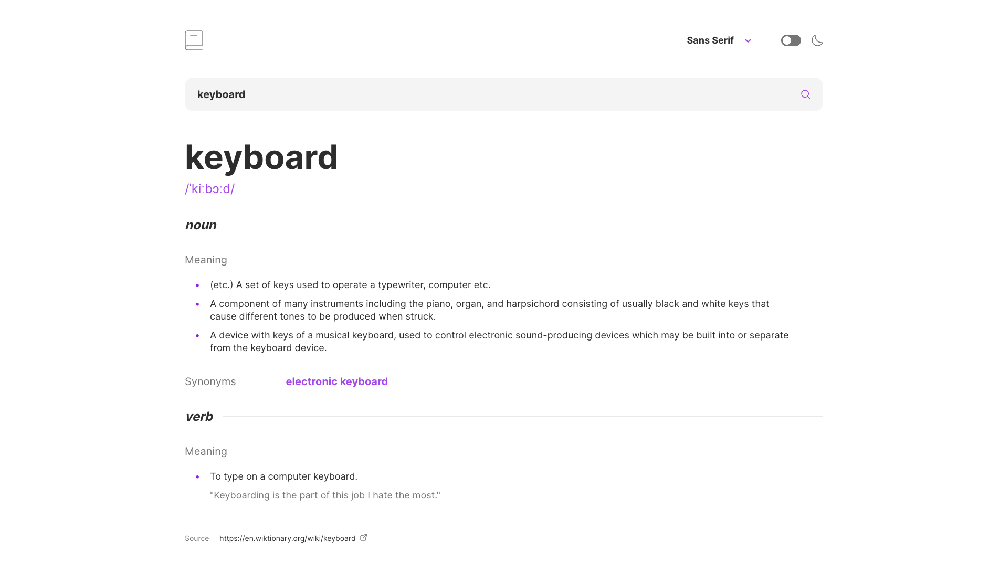

# Dictionary web app

A mobile responsive dictionary web app with dark mode support.

## Overview

### Features

- Search for words and their definitions from the [Free Dictionary API](https://dictionaryapi.dev/)
- Play the pronunciation audio for a word (if available)
- Switch between serif, sans serif, and monospace fonts
- Switch between light and dark themes
- Store font and theme preferences in local storage

### Screenshot



## Built with

- [React](https://reactjs.org/)
- [TypeScript](https://www.typescriptlang.org/)
- [styled-components](https://styled-components.com/)
- [Storybook](https://storybook.js.org/)
- [use-sound](https://github.com/joshwcomeau/use-sound)

## Deployment

This app is deployed to GitHub Pages at https://kwln.github.io/dictionary-web-app/ using [gh-pages](https://github.com/tschaub/gh-pages). To push the app to the repository (and effectively deploy it), run:

```
npm run deploy
```

This will build the app and store it in the `build` directory, then push the contents of that directory to the `gh-pages` branch of the repo.

For end-to-end instructions on how to set up the app and repository for `gh-pages`, see https://github.com/gitname/react-gh-pages.

## Acknowledgement

Credits to [Frontend Mentor](https://www.frontendmentor.io/) for the project idea.
